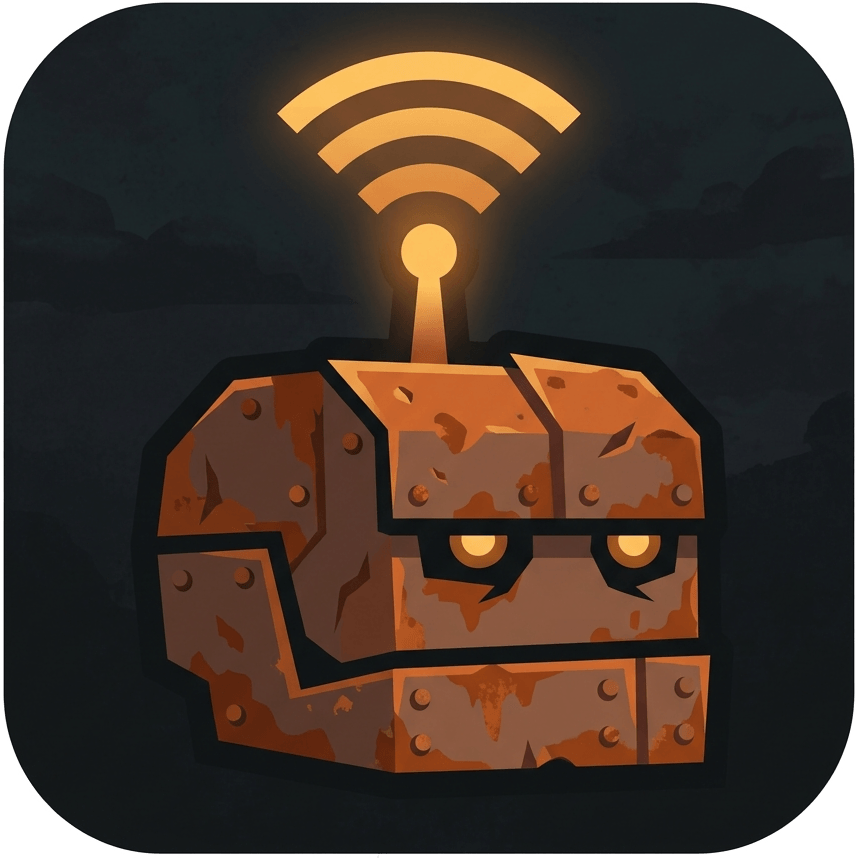

<div align="center">



# RustPlusBot

**A self-hosted Discord bot for the Rust+ companion app** — live map, team & clan chat bridges, smart devices, and a full offline item database, all provisioned automatically in your Discord server.

[](https://github.com/HandyS11/RustPlusBot/actions/workflows/CI.yml)
[](https://github.com/HandyS11/RustPlusBot/actions/workflows/Sonar.yml)
[](https://app.codecov.io/gh/HandyS11/RustPlusBot/tree/develop)
[](https://dotnet.microsoft.com/)
[](LICENSE)

</div>

---

The bot is live: it pairs with Rust+ over FCM, holds a socket per server, and auto-provisions its own Discord channels. Pairing/connection, the team & clan chat bridges, in-game `!commands` and slash surfaces, live map events, map rendering, smart devices (switches, alarms, storage monitors), and an offline item database with nine calculators are all shipped. Cameras are next.

## Channel tour

Once paired, each Rust server gets its own Discord category — every channel below is created, converged, and self-healed automatically:

| Channel | What lives there |
| --- | --- |
| `#info` | Static map image + three auto-refreshing embeds: **Server**, **Events**, **Team** |
| `#teamchat` | Two-way bridge with in-game team chat |
| `#clanchat` / `#claninfo` | Clan bridge, roster/overview/invites embeds and a live change feed — appear only while the paired player is in a clan |
| `#events` | Live feed for Cargo, Patrol Heli, Chinook, and oil-rig activity |
| `#map` | Rendered live map with toggleable layers |
| `#switches` / `#alarms` / `#storagemonitors` | One embed per paired smart device |

Plus a guild-global `RustPlusBot` category with `#information`, `#setup`, and `#settings`.

## Features

### Onboarding & connection

- **Self-provisioning workspace** — `/setup` (Manage Server) creates the global category plus one category per paired server. A declarative reconciler keeps channels/messages converged, self-heals deleted channels, and is idempotent under a per-guild lock.
- **FCM pairing** — connect a Rust+ account from `#setup`; pairing a server in-game auto-registers it (servers are never typed by hand) and the bot provisions that server's channels, after an Accept/Dismiss confirmation for new servers.
- **Credential pool per server** — multiple accounts can pair with the same server; the bot keeps one live socket per `(guild, server)` with **hot-swap** of the active player (`/server player`) and **auto-failover** to a standby credential when one goes invalid (owner is DM'd).
- **Lifecycle controls** — "Remove server" (on `#info`) and "Disconnect account" (on `#setup`), both Manage-Server-gated with a confirmation step; cascade cleanup of channels, credentials, and live state.
- **Live `#info` dashboard** — three auto-refreshing embeds below the map image: **Server** (status, players/queue, in-game time, wipe age), **Events** (cargo / heli / chinook / both oil rigs), and **Team** (per-member presence, grid, and survival time). Refreshed on connection-state changes and on a configurable interval (`Workspace:InfoRefreshInterval`, default 1 min).
- **Bilingual** — every provisioned surface renders in **English or French**, switchable from a select menu in `#settings`.

### Team chat bridge

- Two-way relay between in-game team chat and a per-server `#teamchat` channel (via a managed webhook), with echo/loop suppression.

### Clans

- **Conditional channels** — `#clanchat` and `#claninfo` appear automatically when the paired player is in a clan, and are removed again when they leave; no command to run either way.
- **`#clanchat`** — two-way relay between in-game clan chat and the channel, sharing the same echo/loop suppression as the team bridge.
- **`#claninfo`** — three auto-refreshing embeds — **Overview** (score, member count, creation date, leader, creator, MOTD), **Roster** (members grouped by clan role, online first, with each role's permissions), and **Invites** — plus a live feed of clan changes (members joining/leaving, promotions/demotions, invites, rename, MOTD, logo, colour, score, dissolution).
- **Set MOTD** — a button on the overview embed opens a modal that writes the MOTD back to the game; it is offered only when the paired player's in-game clan role carries the permission.
- **API limits** — the Rust+ API exposes no clan audit log, no per-member scores, and no kick/invite/promote actions, so none of those are implemented; the feed is instead derived by diffing successive clan snapshots.

### Live map events

- Per-server `#events` feed (and an in-game team-chat mirror) for **Cargo Ship**, **Patrol Helicopter**, and **Chinook (CH47)** entering/leaving, plus **small / large oil rig** activation, "crate lootable", and respawn — derived from polling the Rust+ map markers and monuments.

### Map rendering

- Per-server `#map` channel renders the live game map as an image with seven toggleable layers — **Grid**, **Markers**, **Monuments**, **Vendor**, **Players**, **Rigs**, **Tunnels** — controlled from a Manage-Server-gated control message.
- **Readable at a glance** — monument icons, rotor-composited event markers with dashed movement trails, per-teammate coloured crosses with a matching legend embed, and train-tunnel entrances.
- **Grid conventions** — a per-server `MapGridStyle` setting aligns the grid (and every event grid reference) with either the in-game F1 map or the Rust+/RustMaps convention.

### Smart devices

- **Switches** — one embed per paired smart switch in `#switches`, with on/off toggle and rename.
- **Alarms** — paired smart alarms in `#alarms`, with trigger notifications.
- **Storage monitors** — live contents embeds in `#storagemonitors`, with refresh and rename.
- **Reachability** — every device embed shows an inline status when the device is **removed**, **out of building privilege**, or **not responding**, detected on pairing, on actuation, and by periodic polling.

### Item database & calculators

- An **offline, versioned item dataset** (bundled, ~1200 items plus raid targets, smelters, and CCTV codes) behind one lookup seam, exposing nine calculators both in-game and as ephemeral slash commands: item info, recycler yields, craft recipes, research scrap cost, decay time, building-block upkeep, raid cost (`durability`), smelting, and monument CCTV codes.
- **Name-or-id lookup** — type a name (case-insensitive, partial), an exact name, or a numeric id; multiple matches return a short "did you mean" list.
- **Provenance-aware** — each result footers the date its data was sourced, and a maintainer [generator tool](tools/RustPlusBot.ItemData.Generator) regenerates the bundle from upstream (with strict validation) so it never silently rots.

### Foundation

- Multi-guild, self-hosted, per-guild isolation everywhere; SQLite persistence; credentials protected at rest; fail-fast token validation on startup.

## Commands

### In-game `!commands`

Run in team chat by any teammate; replies in the guild's language with a configurable per-server prefix (default `!`) and per-command cooldowns:

| Group | Commands |
| --- | --- |
| Server | `!pop` · `!time` · `!wipe` |
| Team | `!online` · `!offline` · `!team` · `!alive` · `!afk` · `!steamid [name]` · `!prox [name]` |
| Live events | `!cargo` · `!heli` · `!chinook` · `!small` · `!large` · `!events` |
| Items | `!item` · `!recycle` · `!craft` · `!research` · `!decay` · `!upkeep` · `!durability` · `!smelt` · `!cctv` |
| Bot | `!uptime` |
| Control | `!mute` / `!unmute` (gate all bot→game output) |

Live server data (population, in-game time, wipe, team, oil rigs) is no longer a set of ephemeral commands — it renders continuously in the `#info` dashboard, and stays available in-game via the `!commands`.

### Slash commands

| Group | Commands |
| --- | --- |
| Items (ephemeral) | `/item` · `/recycle` · `/craft` · `/research` · `/decay` · `/upkeep` · `/durability` · `/smelt` · `/cctv` |
| Utility | `/help` · `/uptime` · `/ping` · `/status` |
| Manage Server | `/leader` (transfer in-game team leadership) · `/server player` (hot-swap the active paired account) |
| Admin | `/setup` · `/workspace repair` · `/workspace rebuild` · `/workspace purge` · `/workspace reset` · `/workspace simulate-server` · `/admin reset-database` |

## Tech stack

| Component | Library / version |
| --- | --- |
| Runtime | .NET 10 |
| Discord gateway | Discord.Net 3.20 |
| Rust+ client | RustPlusApi (prerelease) |
| Discord persistence | Persistord (prerelease, EF Core 10) |
| Local database | EF Core 10 / SQLite |

## Getting started

```bash
dotnet build RustPlusBot.slnx
dotnet test RustPlusBot.slnx
```

To run the bot locally, see [docs/development/running-locally.md](docs/development/running-locally.md).

## Project layout

| Project | Responsibility |
| --- | --- |
| `RustPlusBot.Abstractions` | Shared seams: `IClock`, `IEventBus`, credential/connection contracts, events |
| `RustPlusBot.Domain` | Entities and enums |
| `RustPlusBot.Persistence` | `BotDbContext`, EF Core services, SQLite migrations |
| `RustPlusBot.Localization` | Shared bilingual string catalog (`Strings.resx`) and `ILocalizer` |
| `RustPlusBot.Discord` | Discord.Net gateway, hosted service, interaction modules |
| `RustPlusBot.Features.Workspace` | Channel/message provisioning, reconciler, `#info`/`#setup`/`#settings` surfaces |
| `RustPlusBot.Features.Pairing` | FCM pairing listener, credential intake, account disconnect |
| `RustPlusBot.Features.Connections` | Live socket supervisor, hot-swap/failover, Rust+ query seam |
| `RustPlusBot.Features.Chat` | Two-way `#teamchat` / `#clanchat` ↔ in-game chat bridges |
| `RustPlusBot.Features.Clans` | Clan state, `#claninfo` embeds and change feed, Set MOTD |
| `RustPlusBot.Features.Commands` | In-game `!commands`, slash surfaces, `/help`/`/leader` |
| `RustPlusBot.Features.Events` | Live map-event classification + `#events` feed |
| `RustPlusBot.Features.Map` | Map image rendering with toggleable layers |
| `RustPlusBot.Features.Players` | Team presence, AFK tracking, `#info` Team embed |
| `RustPlusBot.Features.Wipes` | Wipe detection and wipe-age tracking |
| `RustPlusBot.Features.Switches` | Smart-switch embeds and toggling |
| `RustPlusBot.Features.Alarms` | Smart-alarm embeds and trigger notifications |
| `RustPlusBot.Features.StorageMonitors` | Storage-monitor contents embeds |
| `RustPlusBot.Features.ItemData` | Bundled item dataset, lookup seam, calculator data |
| `RustPlusBot.Host` | Generic Host entry point, DI wiring, startup validation |

The `tools/` folder holds maintainer utilities that are not part of the running bot — currently [`RustPlusBot.ItemData.Generator`](tools/RustPlusBot.ItemData.Generator), which regenerates the embedded item dataset.

## Roadmap

Subsystems are built in order; each has its own spec → plan → build cycle.

| # | Subsystem | Status |
| --- | --- | --- |
| 0 | Foundation (bootable host, config/persistence, workspace provisioning) | ✅ Done |
| 1 | Pairing & connection (FCM, credential pool, hot-swap, auto-failover) | ✅ Done |
| 2 | Map + live events (events feed, oil-rig detection, map render + layers) | ✅ Done |
| 3 | Chat bridge + `!commands` + slash surfaces | ✅ Done |
| 4 | Smart devices (switches, alarms, storage monitors, reachability) | ✅ Done |
| 5 | Cameras | 🔜 Planned |
| 6 | Item database & calculators (recycle/craft/research/decay/upkeep/durability/smelt/cctv) | ✅ Done |

## License

MIT — see [LICENSE](LICENSE).
